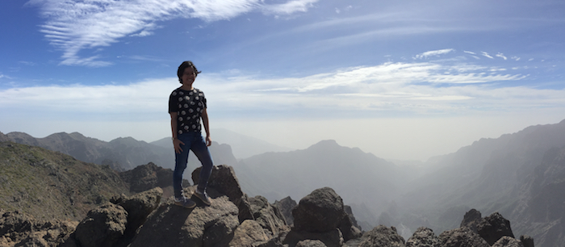

I am a **computational and theoretical evolutionary paleobiologist** who is primarily interested in developing novel methodologies and tools in order to answer questions about **macroevolutionary dynamics in deep time.**

Currently, I am a postdoctoral researcher with Fredrik Ronquist at the <a href="https://www.nrm.se/en/16.html" target="_blank">Swedish Museum of Natural History</a>, working on improving **probabilistic models of morphological evolution for phylogenetic inference.**

 
My research uses **statistical modeling, Bayesian inference, Big Data, and machine learning** to understand morphological evolution and macroevolutionary patterns and processes. I am particularly interested in bringing a ‘next-generation’ approach (<em>e.g.</em>, high-throughput automated data generation) to studying **fossils and morphology** in a phylogenetic context. I am also interested in the interplay between morphology and genetics/genomics, including methodological considerations during phylogenetic inference (<em>e.g.</em>, phylogenetic incongruence, total-evidence analyses, etc.).

I work with both **vertebrate and invertebrate systems**. Taxonomic groups I have worked with include turtles, squamate lizards, birds, mammals, and planktonic foraminifera.

By bridging the fields of **statistical modeling, computer science, and evolutionary biology**, I aim to deliver a unique and creative perspective towards understanding evolution and the history of life on earth.

<ps>Parque Nacional De La Caldera De Taburiente, La Palma, Canary Islands / Photo by Mariana Pires Braga</ps>
