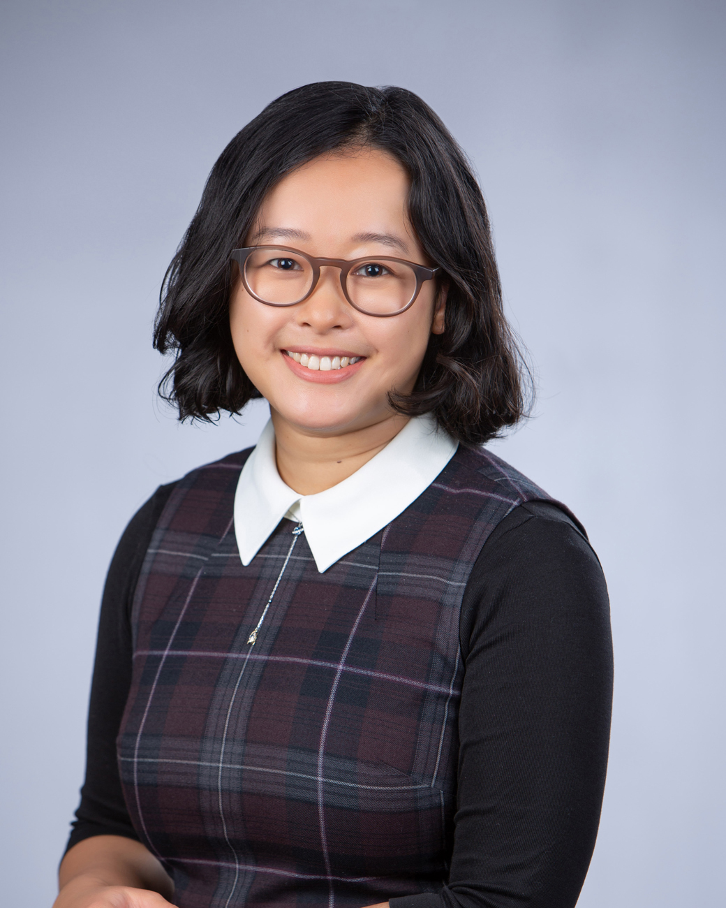
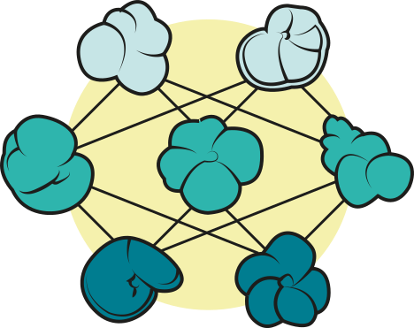

I am a **computational evolutionary paleobiologist** who is primarily interested in developing novel methodologies and tools in order to answer questions about **macroevolutionary dynamics in deep time.**

Currently, I am an early career researcher at Stockholm University in the <a href="https://www.su.se/geo/english/" target="_blank">Department of Geological Sciences</a> (IGV), working on applying deep learning and computer vision to understanding the morphological evolution of planktonic foraminifer communities across the K-Pg boundary. This project is supported by a starting grant within natural and engineering sciences awarded by the <a href="https://www.vr.se/" target="_blank">Swedish Research Council</a>.

 
My research uses **machine learning, high-throughput imaging, and statistical modelling** to understand morphological evolution and macroevolutionary patterns and processes. I am particularly interested in bringing a ‘next-generation’ approach (<em>e.g.</em>, automated Big data collection) to studying **morphological evolution in deep time**.

I work with both **vertebrate and invertebrate systems**. Taxonomic groups I have worked with include turtles, squamate lizards, birds, mammals, and planktonic foraminifera.

By bridging the fields of **computer science and evolutionary biology**, I aim to deliver a unique and creative perspective towards understanding evolution and the history of life on earth.
